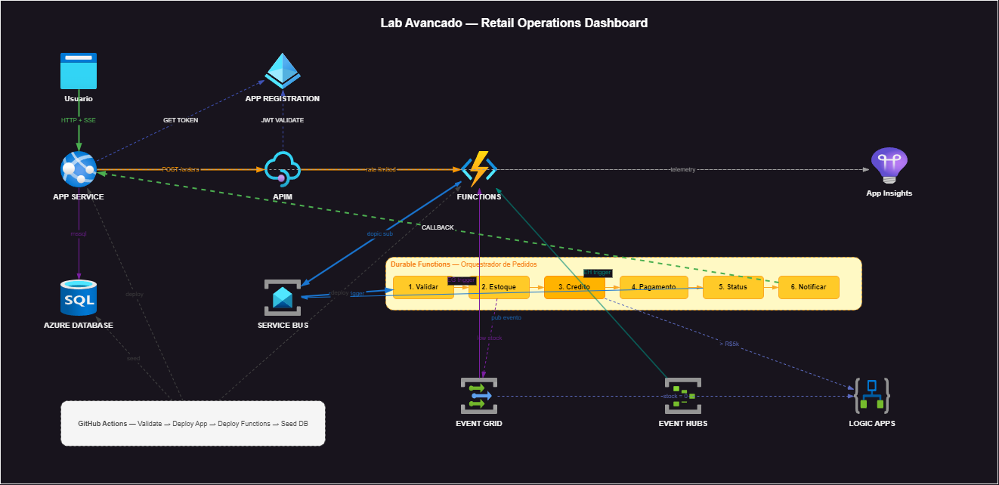
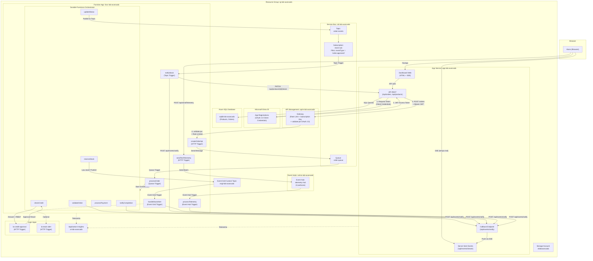

# Lab Avancado -- Retail Operations Dashboard: App Service + SQL Database + APIM + Logic Apps + Durable Functions + Mensageria em Tempo Real

> **CUSTO E FREE TRIAL**
> | Item | Valor |
> |------|-------|
> | Custo mensal (se deixar rodando) | ~R$ 260 (App Service B1 + SQL Serverless + APIM Consumption + Service Bus + Event Hubs + Logic Apps) |
> | Custo real do hands-on (provisionar e deletar no mesmo dia) | ~R$ 12-15 |
> | Compativel com Azure Free Trial (USD 200)? | **Sim** |
>
> **Regra de ouro:** Delete o Resource Group (`rg-lab-avancado`) assim que terminar o hands-on. Os principais custos diarios sao: App Service B1 (~R$ 3/dia), SQL Serverless (~R$ 1-2/dia quando ativo), APIM Consumption (~R$ 1/dia base), Service Bus Standard (~R$ 2/dia), Event Hubs Standard (~R$ 4/dia).

## Guia Passo-a-Passo no Azure Portal

**Disciplina:** Integracao e Mensageria no Azure
**Nivel:** Avancado -- Exercicio Integrado Final
**Cenario:** Dashboard de operacoes de varejo em tempo real que combina App Service (frontend + API), Azure SQL Database (dados relacionais), API Management (gateway com rate-limiting), Azure Functions com Durable Functions (orquestracao multi-etapa), Logic Apps (workflows automatizados de aprovacao de credito e alertas de estoque), Service Bus (filas e topicos), Event Grid (alertas push) e Event Hubs (telemetria em escala). O aluno visualiza o fluxo completo de um pedido desde a criacao ate a notificacao de estoque baixo, passando por todas as etapas do pipeline de orquestracao, tudo em tempo real no browser.

---

## Pre-requisitos

- Conta Azure ativa (Free Trial com USD 200, Azure for Students ou Pay-As-You-Go)
- Navegador web atualizado (Edge, Chrome ou Firefox)
- [VS Code](https://code.visualstudio.com/) com as extensoes Azure Functions e Azure App Service (recomendado para deploy)
- Conhecimento dos modulos anteriores (App Service, SQL Database, Functions, Service Bus, Event Grid, Event Hubs, API Management, Logic Apps)
- Codigo de referencia disponivel em `functions/` (Azure Functions) e `dashboard/` (App Service)

---

## Tabela de Recursos

| Recurso | Tipo | SKU/Tier | Custo Estimado (mensal) |
|---------|------|----------|------------------------|
| `rg-lab-avancado` | Resource Group | N/A | Gratuito |
| `sql-lab-avancado` | SQL Server (logical) | N/A | Gratuito (servidor logico) |
| `sqldb-lab-avancado` | SQL Database | Serverless Gen5, 1 vCore, auto-pause 1h | ~R$ 25 |
| `asp-lab-avancado` | App Service Plan | B1 (Linux) | ~R$ 30 |
| `app-lab-avancado` | App Service (Web App) | B1 Linux, Node.js 20 | Incluido no plano |
| `apim-lab-avancado` | API Management | Consumption | ~R$ 20 (base + R$ 0,035/10k calls) |
| `sb-lab-avancado` | Service Bus Namespace | Standard | ~R$ 55 |
| `order-queue` | Service Bus Queue | -- | Incluido no namespace |
| `order-events` | Service Bus Topic | -- | Incluido no namespace |
| `stock-sub` | Subscription (filtro: eventType = 'order.approved') | -- | Incluido no namespace |
| `evgt-lab-avancado` | Event Grid Custom Topic | -- | Gratuito (100K eventos/mes) |
| `evhns-lab-avancado` | Event Hubs Namespace | Standard (1 TU) | ~R$ 115 |
| `telemetry-hub` | Event Hub | 2 particoes, 1 dia retencao | Incluido no namespace |
| `func-lab-avancado` | Function App (com Durable Functions) | Consumption (Y1) | Gratuito (1M exec/mes gratis) |
| `la-credit-approval` | Logic App | Consumption | ~R$ 1 |
| `la-stock-alert` | Logic App | Consumption | ~R$ 1 |
| `ai-lab-avancado` | Application Insights | Workspace-based | ~R$ 5 |
| `stlabavancado` | Storage Account | Standard LRS | ~R$ 1 |
| `app-reg-lab-api` | Entra ID App Registration | N/A | Gratuito |
| `app-reg-lab-dashboard` | Entra ID App Registration | N/A | Gratuito |

> **Custo total estimado:** ~R$ 260/mes se deixar rodando. Para fins de exercicio, com provisionar e deletar no mesmo dia, o custo real sera de ~R$ 12-15.

---

## Diagrama da Arquitetura



> **Nota:** O diagrama acima esta disponivel em formato editavel em [`docs/arquitetura.drawio`](arquitetura.drawio). Abra no [draw.io](https://app.diagrams.net/) para visualizar com os icones Azure.

<details>
<summary>Versao Mermaid (alternativa textual)</summary>



</details>

---

## Etapa 1 -- Criar o Resource Group

**Tempo estimado:** ~2 minutos

### Passo 1.1: Navegar ate Resource Groups

1. Acesse o **Azure Portal**: [https://portal.azure.com](https://portal.azure.com)
2. Na barra de busca superior, digite **Resource groups** e clique no resultado

### Passo 1.2: Criar o Resource Group

1. Clique em **+ Create**
2. Preencha os campos:

| Campo | Valor |
|-------|-------|
| **Subscription** | Sua subscription ativa |
| **Resource group** | `rg-lab-avancado` |
| **Region** | `Brazil South` |

3. Clique em **Review + create**
4. Clique em **Create**

> **Verificacao:** O resource group `rg-lab-avancado` deve aparecer na lista de resource groups.

---

## Etapa 2 -- Provisionar o Azure SQL Database

**Tempo estimado:** ~10 minutos

### Passo 2.1: Navegar ate SQL Databases

1. Na barra de busca superior, digite **SQL databases** e clique no resultado
2. Clique em **+ Create**

### Passo 2.2: Criar o SQL Server (servidor logico)

Na aba **Basics**, na secao **Server**, clique em **Create new**:

| Campo | Valor |
|-------|-------|
| **Server name** | `sql-lab-avancado` (globalmente unico; se ja existir, adicione suas iniciais, ex: `sql-lab-avancado-gc`) |
| **Location** | `Brazil South` |
| **Authentication method** | `Use SQL authentication` |
| **Server admin login** | `sqladmin` |
| **Password** | Escolha uma senha forte (minimo 8 caracteres, com maiusculas, minusculas, numeros e simbolos. Ex: `Lab@vancado2026!`) |
| **Confirm password** | Repita a mesma senha |

Clique em **OK** para confirmar a criacao do servidor.

### Passo 2.3: Configurar o Database

Ainda na aba **Basics**, preencha:

| Campo | Valor |
|-------|-------|
| **Subscription** | Sua subscription ativa |
| **Resource group** | `rg-lab-avancado` |
| **Database name** | `sqldb-lab-avancado` |
| **Server** | `sql-lab-avancado` (recem-criado) |
| **Want to use SQL elastic pool?** | `No` |
| **Workload environment** | `Development` |

### Passo 2.4: Configurar Compute + Storage

1. Clique em **Configure database** (ao lado de Compute + storage)
2. Selecione **Serverless**
3. Configure:

| Campo | Valor | Explicacao |
|-------|-------|------------|
| **Hardware configuration** | `Standard-series (Gen5)` | Processadores Intel de ultima geracao |
| **Max vCores** | `1` | Suficiente para o lab |
| **Min vCores** | `0.5` | Minimo para economia |
| **Auto-pause delay** | `1 hour` | Pausa apos 1h de inatividade (economia!) |
| **Data max size** | `1 GB` | Mais que suficiente para o lab |
| **Backup storage redundancy** | `Locally-redundant backup storage` | Mais barato |

4. Clique em **Apply**

> **Por que Serverless?** O tier Serverless escala automaticamente e faz auto-pause quando nao ha atividade. Para um lab, isso significa que voce so paga pelo tempo efetivo de uso. Quando pausado, o custo cai para apenas o armazenamento (~R$ 2.5/mes por GB).

5. Clique em **Review + create**
6. Clique em **Create**
7. Aguarde o deploy (2-5 minutos)
8. Clique em **Go to resource**

### Passo 2.5: Configurar Firewall do SQL Server

1. Na pagina do SQL Database `sqldb-lab-avancado`, clique em **Set server firewall** (na barra superior) ou navegue ate o servidor `sql-lab-avancado` > **Networking**
2. Na secao **Firewall rules**:
   - Clique em **+ Add your client IPv4 address** (adiciona automaticamente seu IP atual)
3. Na secao **Exceptions**:
   - Marque **Allow Azure services and resources to access this server**

> **Por que Allow Azure services?** As Azure Functions, o App Service e o API Management precisam se conectar ao SQL Database. Como sao servicos Azure, esta opcao permite o acesso sem precisar listar cada IP individualmente.

4. Clique em **Save**

> **Nota:** O schema das tabelas (Products, Orders, OrderItems, EventLog, Metrics) e os 12 produtos iniciais serao criados automaticamente pelo GitHub Actions na Etapa 10 (Deploy). Voce nao precisa executar nenhum SQL manualmente.

---

## Etapa 3 -- Criar o App Service

**Tempo estimado:** ~8 minutos

### Passo 3.1: Navegar ate App Services

1. Na barra de busca superior, digite **App Services** e clique no resultado
2. Clique em **+ Create** > **Web App**

### Passo 3.2: Configurar o Web App

Na aba **Basics**, preencha:

| Campo | Valor |
|-------|-------|
| **Subscription** | Sua subscription ativa |
| **Resource group** | `rg-lab-avancado` |
| **Name** | `app-lab-avancado` (globalmente unico; se ja existir, adicione suas iniciais) |
| **Publish** | `Code` |
| **Runtime stack** | `Node 20 LTS` |
| **Operating System** | `Linux` |
| **Region** | `Brazil South` |

Na secao **App Service Plan**:

| Campo | Valor |
|-------|-------|
| **Linux Plan** | Clique em **Create new** > nome: `asp-lab-avancado` |
| **Pricing plan** | `Basic B1` (clique em **Change size** se necessario e selecione B1 na aba Development/Testing) |

> **Por que B1 e nao F1 (Free)?** O tier Free (F1) nao suporta "Always On" e tem limitacoes de CPU/memoria que podem causar timeouts nas conexoes SSE (Server-Sent Events). O B1 garante que a aplicacao fique ativa continuamente e consiga manter as conexoes SSE abertas para o dashboard em tempo real.

### Passo 3.3: Configurar Monitoring

Na aba **Monitoring**:

| Campo | Valor |
|-------|-------|
| **Enable Application Insights** | `Yes` |
| **Application Insights** | Clique em **Create new** > nome: `ai-lab-avancado` > **OK** |

3. Clique em **Review + create**
4. Clique em **Create**
5. Aguarde o deploy (1-3 minutos)
6. Clique em **Go to resource**

### Passo 3.4: Configurar Application Settings (Variaveis de Ambiente)

1. No App Service `app-lab-avancado`, no menu lateral, em **Settings**, clique em **Environment variables**
2. Na aba **App settings**, clique em **+ Add** para cada variavel:

| Name | Value | Onde obter |
|------|-------|------------|
| `SQL_SERVER` | `sql-lab-avancado.database.windows.net` | Nome do servidor SQL + `.database.windows.net` |
| `SQL_DATABASE` | `sqldb-lab-avancado` | Nome do database |
| `SQL_USER` | `sqladmin` | Login definido na Etapa 2 |
| `SQL_PASSWORD` | `Lab@vancado2026!` | Senha definida na Etapa 2 |
| `SERVICEBUS_CONNECTION_STRING` | (sera preenchido na Etapa 4) | Connection string do Service Bus |
| `SERVICEBUS_QUEUE_NAME` | `order-queue` | Nome fixo da fila |
| `APIM_BASE_URL` | (sera preenchido na Etapa 5) | URL base do APIM |
| `APIM_SUBSCRIPTION_KEY` | (sera preenchido na Etapa 5) | Subscription key do APIM |
| `NODE_ENV` | `production` | Ambiente de execucao |

| `AZURE_TENANT_ID` | (sera preenchido na Etapa 13) | Tenant ID do Entra ID |
| `AZURE_CLIENT_ID` | (sera preenchido na Etapa 13) | Client ID do app-reg-lab-dashboard |
| `AZURE_CLIENT_SECRET` | (sera preenchido na Etapa 13) | Client secret do app-reg-lab-dashboard |
| `AZURE_API_SCOPE` | (sera preenchido na Etapa 13) | Scope da API: `api://{client-id}/.default` |

3. Clique em **Apply**
4. Clique em **Apply** novamente e confirme com **Confirm**

> **Importante:** As variaveis `SERVICEBUS_CONNECTION_STRING`, `APIM_BASE_URL`, `APIM_SUBSCRIPTION_KEY` e as variaveis `AZURE_*` (autenticacao OAuth 2.0) serao preenchidas nas etapas seguintes. Volte aqui para atualiza-las conforme avanca no lab.

### Passo 3.5: Configurar CORS

1. No menu lateral do App Service, em **API**, clique em **CORS**
2. Em **Allowed Origins**, adicione: `*` (asterisco -- permite todas as origens para o lab)
3. Clique em **Save**

> **Nota:** Em producao, NUNCA use `*`. Especifique as origens exatas (ex: `https://meu-frontend.com`).

---

## Etapa 4 -- Provisionar o Service Bus

**Tempo estimado:** ~8 minutos

### Passo 4.1: Navegar ate Service Bus

1. Na barra de busca superior, digite **Service Bus** e clique em **Service Bus**
2. Clique em **+ Create**

### Passo 4.2: Configurar o Namespace

Na aba **Basics**, preencha:

| Campo | Valor |
|-------|-------|
| **Subscription** | Sua subscription ativa |
| **Resource group** | `rg-lab-avancado` |
| **Namespace name** | `sb-lab-avancado` (globalmente unico; se ja existir, adicione suas iniciais) |
| **Location** | `Brazil South` |
| **Pricing tier** | `Standard` |

> **Por que Standard?** O tier Basic suporta apenas Queues. Como precisamos de Topics e Subscriptions para o roteamento de eventos de pedidos, o tier Standard eh obrigatorio.

3. Clique em **Review + create**
4. Clique em **Create**
5. Aguarde o deploy (1-2 minutos)
6. Clique em **Go to resource**

### Passo 4.3: Criar a Queue "order-queue"

1. No blade do Service Bus Namespace, no menu lateral, em **Entities**, clique em **Queues**
2. Clique em **+ Queue**
3. Preencha:

| Campo | Valor | Explicacao |
|-------|-------|------------|
| **Name** | `order-queue` | Fila para novos pedidos |
| **Max queue size** | `1 GB` | Tamanho maximo |
| **Max delivery count** | `5` | Tentativas antes do Dead-Letter |
| **Message time to live** | `1` day | Tempo maximo na fila |
| **Lock duration** | `30` seconds | Tempo de processamento |
| **Enable dead-lettering on message expiration** | **Marcado** | Mensagens expiradas vao para DLQ |
| **Enable duplicate detection** | Desmarcado | Nao necessario |
| **Enable sessions** | Desmarcado | Nao necessario |
| **Enable partitioning** | Desmarcado | Nao necessario |

4. Clique em **Create**

> **Cenario:** Quando o aluno cria um pedido no dashboard, o App Service envia a requisicao via APIM para a Function `createOrderApi`, que coloca uma mensagem nesta fila. O Durable Functions orchestrator consome a mensagem e processa o pedido em multiplas etapas visiveis no dashboard.

### Passo 4.4: Criar o Topic "order-events"

1. No menu lateral, em **Entities**, clique em **Topics**
2. Clique em **+ Topic**
3. Preencha:

| Campo | Valor |
|-------|-------|
| **Name** | `order-events` |
| **Max topic size** | `1 GB` |
| **Message time to live** | `1` day |
| **Auto-delete on idle** | Desmarcado |
| **Support ordering** | Desmarcado |
| **Enable duplicate detection** | Desmarcado |
| **Enable partitioning** | Desmarcado |

4. Clique em **Create**

### Passo 4.5: Criar Subscription "stock-sub"

1. Na lista de Topics, clique em **order-events**
2. Clique em **+ Subscription**
3. Preencha:

| Campo | Valor |
|-------|-------|
| **Name** | `stock-sub` |
| **Max delivery count** | `5` |
| **Lock duration** | `30` seconds |
| **Enable dead-lettering on message expiration** | Marcado |
| **Enable sessions** | Desmarcado |

4. Clique em **Create**

### Passo 4.6: Adicionar Filtro SQL ao stock-sub

1. Na lista de Subscriptions do topic, clique em **stock-sub**
2. No menu lateral, em **Settings**, clique em **Rules**
3. Voce vera a regra padrao `$Default`. Clique nela para editar, ou delete-a e crie uma nova:
   - Clique em **+ Add** (ou edite a `$Default`)
   - **Name:** `filtro-pedido-aprovado`
   - **Filter type:** `SQL Filter`
   - **SQL Filter Expression:** `eventType = 'order.approved'`
   - Clique em **Create** (ou **Save**)

> **Como funciona?** O Service Bus avalia a expressao SQL contra as **application properties** de cada mensagem. Somente mensagens cuja propriedade `eventType` tenha o valor `order.approved` serao entregues a esta subscription. Isso evita que eventos irrelevantes disparem a function `notifyStock`.

### Passo 4.7: Obter a Connection String do Service Bus

1. Volte ao blade do Service Bus Namespace `sb-lab-avancado`
2. No menu lateral, em **Settings**, clique em **Shared access policies**
3. Clique na politica **RootManageSharedAccessKey**
4. Copie o campo **Primary Connection String**
5. Guarde esta connection string -- formato:
   ```
   Endpoint=sb://sb-lab-avancado.servicebus.windows.net/;SharedAccessKeyName=RootManageSharedAccessKey;SharedAccessKey=<chave>
   ```

> **Acao necessaria:** Volte ao App Service (Etapa 3, Passo 3.4) e atualize a variavel `SERVICEBUS_CONNECTION_STRING` com o valor copiado. Clique em **Apply** e confirme.

---

## Etapa 5 -- Provisionar o API Management

**Tempo estimado:** ~15 minutos (o APIM Consumption leva 5-10 minutos para ativar)

### Passo 5.1: Navegar ate API Management

1. Na barra de busca superior, digite **API Management services** e clique no resultado
2. Clique em **+ Create**

### Passo 5.2: Configurar o APIM

Na aba **Basics**, preencha:

| Campo | Valor |
|-------|-------|
| **Subscription** | Sua subscription ativa |
| **Resource group** | `rg-lab-avancado` |
| **Region** | `Brazil South` |
| **Resource name** | `apim-lab-avancado` (globalmente unico; se ja existir, adicione suas iniciais) |
| **Organization name** | `Lab Avancado` |
| **Administrator email** | Seu email de estudante |
| **Pricing tier** | `Consumption` |

> **Por que Consumption?** O tier Consumption cobra apenas por chamada (R$ 0,035 por 10.000 chamadas) com um custo base baixo (~R$ 20/mes). Para um lab, eh o tier mais economico. Tiers como Developer ou Standard custam R$ 250+/mes.

### Passo 5.3: Configurar Monitoring

Na aba **Monitoring**:

| Campo | Valor |
|-------|-------|
| **Enable Application Insights** | `Yes` |
| **Application Insights** | Selecione `ai-lab-avancado` (criado junto com o App Service) |

3. Clique em **Review + create**
4. Clique em **Create**
5. **Aguarde o deploy (5-10 minutos)** -- O APIM Consumption pode levar mais tempo que outros recursos. Acompanhe o progresso em **Notifications** (icone de sino no topo do portal).
6. Clique em **Go to resource**

### Passo 5.4: Criar a API "Retail Operations API"

1. No blade do APIM, no menu lateral, em **APIs**, clique em **APIs**
2. Na secao **Define a new API**, clique em **HTTP** (Manual creation)
3. Preencha o formulario:

| Campo | Valor |
|-------|-------|
| **Display name** | `Retail Operations API` |
| **Name** | `retail-operations-api` |
| **Description** | `API gateway para operacoes de varejo` |
| **API URL suffix** | `retail` |
| **Web service URL** | `https://func-lab-avancado.azurewebsites.net/api` |

4. Clique em **Create**

### Passo 5.5: Adicionar a Operacao POST /orders

1. Com a API `Retail Operations API` selecionada, clique em **+ Add operation**
2. Preencha:

| Campo | Valor |
|-------|-------|
| **Display name** | `Create Order` |
| **Name** | `create-order` |
| **URL** | `POST` `/orders` |

3. Na aba **Backend**, configure:

| Campo | Valor |
|-------|-------|
| **Service URL override** | `https://func-lab-avancado.azurewebsites.net/api/createOrder` |

4. Clique em **Save**

### Passo 5.6: Associar a API ao Produto "Unlimited"

1. No menu lateral do APIM, em **APIs**, clique em **Products**
2. Clique em **Unlimited**
3. Na pagina do produto, clique em **+ Add API**
4. Selecione **Retail Operations API**
5. Clique em **Select**

> **Por que associar a um Product?** No APIM, APIs precisam estar associadas a pelo menos um Product para serem acessiveis. O Product "Unlimited" vem pre-criado e nao possui rate-limit no nivel do produto, mas vamos adicionar rate-limit via policy no nivel da API.

### Passo 5.7: Obter a Subscription Key

1. No menu lateral do APIM, em **APIs**, clique em **Subscriptions**
2. Localize a subscription **Built-in all-access** (ou qualquer subscription ativa)
3. Clique nos tres pontos (**...**) ao lado da subscription e selecione **Show/hide keys**
4. Copie a **Primary key**
5. Guarde esta chave -- sera usada como `APIM_SUBSCRIPTION_KEY`

> **Acao necessaria:** Volte ao App Service (Etapa 3, Passo 3.4) e atualize as variaveis:
> - `APIM_BASE_URL` = `https://apim-lab-avancado.azure-api.net/retail`
> - `APIM_SUBSCRIPTION_KEY` = (a chave copiada acima)
>
> Clique em **Apply** e confirme.

### Passo 5.8: Configurar Inbound Policies (Rate Limit + CORS)

1. Volte a secao **APIs** > clique em **Retail Operations API**
2. Clique em **All operations** (na lista de operacoes a esquerda)
3. Na secao **Inbound processing**, clique no icone **</>** (Code editor) ou em **+ Add policy**
4. Substitua o conteudo do bloco `<inbound>` pelo seguinte:

```xml
<inbound>
    <base />
    <rate-limit calls="60" renewal-period="60" />
    <cors>
        <allowed-origins>
            <origin>*</origin>
        </allowed-origins>
        <allowed-methods>
            <method>*</method>
        </allowed-methods>
        <allowed-headers>
            <header>*</header>
        </allowed-headers>
    </cors>
</inbound>
```

5. Clique em **Save**

> **O que essas policies fazem?**
> - **rate-limit:** Limita a 60 chamadas por minuto por subscription. Se exceder, o APIM retorna HTTP 429 (Too Many Requests). Isso protege o backend contra abusos.
> - **cors:** Permite chamadas de qualquer origem (para o lab). Em producao, especifique origens exatas.

### Passo 5.9: Testar a API no Portal

1. Ainda em **APIs** > **Retail Operations API**, clique na operacao **Create Order**
2. Clique na aba **Test** (no topo)
3. O header `Ocp-Apim-Subscription-Key` ja estara preenchido automaticamente
4. Na secao **Request body**, selecione **Raw** e cole:

```json
{
    "customerName": "Teste APIM",
    "items": [
        {
            "productId": 1,
            "quantity": 1
        }
    ]
}
```

5. Clique em **Send**
6. Verifique a resposta:
   - **Status:** `200 OK` ou `201 Created`
   - **Body:** JSON com os dados do pedido criado

> **Nota:** Se o Function App ainda nao foi deployado (Etapa 10), esse teste retornara erro 404 ou 502. Voce pode voltar para testar apos o deploy. O importante aqui eh verificar que o APIM consegue rotear a requisicao (mesmo que o backend nao esteja pronto).

---

## Etapa 6 -- Provisionar o Event Grid

**Tempo estimado:** ~5 minutos

### Passo 6.1: Navegar ate Event Grid Topics

1. Na barra de busca superior, digite **Event Grid Topics** e clique no resultado
2. Clique em **+ Create**

### Passo 6.2: Configurar o Custom Topic

| Campo | Valor |
|-------|-------|
| **Subscription** | Sua subscription |
| **Resource group** | `rg-lab-avancado` |
| **Name** | `evgt-lab-avancado` (globalmente unico; adicione iniciais se necessario) |
| **Region** | `Brazil South` |
| **Event Schema** | `Cloud Event Schema v1.0` |

3. Clique em **Review + create**
4. Clique em **Create**
5. Clique em **Go to resource**

### Passo 6.3: Obter Endpoint e Access Key

1. No blade do Custom Topic, copie o **Topic Endpoint** (exibido na pagina de Overview)
   - Formato: `https://evgt-lab-avancado.brazilsouth-1.eventgrid.azure.net/api/events`
2. No menu lateral, clique em **Access keys** (em **Settings**)
3. Copie a **Key 1**
4. Guarde ambos os valores -- serao usados na configuracao do Function App

---

## Etapa 7 -- Provisionar o Event Hubs

**Tempo estimado:** ~5 minutos

### Passo 7.1: Navegar ate Event Hubs

1. Na barra de busca superior, digite **Event Hubs** e clique em **Event Hubs**
2. Clique em **+ Create**

### Passo 7.2: Configurar o Namespace

Na aba **Basics**, preencha:

| Campo | Valor |
|-------|-------|
| **Subscription** | Sua subscription ativa |
| **Resource group** | `rg-lab-avancado` |
| **Namespace name** | `evhns-lab-avancado` (globalmente unico; adicione iniciais se necessario) |
| **Location** | `Brazil South` |
| **Pricing tier** | `Standard` |
| **Throughput Units** | `1` |

> **Por que Standard?** O tier Basic nao suporta Consumer Groups customizados. Embora neste lab usemos apenas `$Default`, o Standard oferece flexibilidade para Consumer Groups adicionais e Capture.

3. Clique em **Review + create**
4. Clique em **Create**
5. Aguarde o deploy (1-2 minutos)
6. Clique em **Go to resource**

### Passo 7.3: Criar o Event Hub "telemetry-hub"

1. No blade do Event Hubs Namespace, no menu lateral, em **Entities**, clique em **Event Hubs**
2. Clique em **+ Event Hub**
3. Preencha:

| Campo | Valor | Explicacao |
|-------|-------|------------|
| **Name** | `telemetry-hub` | Hub para dados de telemetria do varejo |
| **Partition count** | `2` | 2 particoes para demonstrar paralelismo |
| **Message retention** | `1` day | Retencao de 1 dia |
| **Capture** | Desmarcado | Nao necessario para este lab |

4. Clique em **Create**

### Passo 7.4: Obter a Connection String do Event Hubs

1. Volte ao blade do Event Hubs Namespace `evhns-lab-avancado`
2. No menu lateral, em **Settings**, clique em **Shared access policies**
3. Clique na politica **RootManageSharedAccessKey**
4. Copie a **Primary Connection String**
5. Guarde esta connection string -- formato:
   ```
   Endpoint=sb://evhns-lab-avancado.servicebus.windows.net/;SharedAccessKeyName=RootManageSharedAccessKey;SharedAccessKey=<chave>
   ```

---

## Etapa 8 -- Criar as Logic Apps

**Tempo estimado:** ~10 minutos

### Passo 8.1: Criar a Logic App "la-credit-approval"

1. Na barra de busca superior, digite **Logic App** e clique em **Logic Apps**
2. Clique em **+ Add**
3. Na aba **Basics**, preencha:

| Campo | Valor |
|-------|-------|
| **Subscription** | Sua subscription ativa |
| **Resource group** | `rg-lab-avancado` |
| **Logic App name** | `la-credit-approval` |
| **Region** | `Brazil South` |
| **Plan type** | `Consumption` |

> **Por que Consumption?** O plano Consumption cobra apenas por execucao (~R$ 0,000025 por acao). Para um lab com poucas execucoes, o custo eh praticamente zero (~R$ 1/mes).

4. Clique em **Review + create**
5. Clique em **Create**
6. Aguarde o deploy (1-2 minutos)
7. Clique em **Go to resource**

### Passo 8.2: Configurar o Workflow de Credit Approval

1. Na pagina da Logic App, clique em **Logic App Designer** no menu lateral (ou **Edit** se ja estiver na pagina de overview)
2. Na galeria de templates, selecione **Blank Logic App** (ou **When a HTTP request is received** se disponivel)

**Configurar o Trigger:**

3. Pesquise e selecione o trigger **When a HTTP request is received**
4. Em **Request Body JSON Schema**, cole:

```json
{
    "type": "object",
    "properties": {
        "orderId": {
            "type": "string"
        },
        "customerName": {
            "type": "string"
        },
        "totalAmount": {
            "type": "number"
        }
    }
}
```

5. Em **Method**, selecione **POST**

**Adicionar a Condicao:**

6. Clique em **+ New step**
7. Pesquise e selecione **Condition** (Control)
8. Configure a condicao:
   - Clique no campo **Choose a value** (esquerda) e selecione **totalAmount** na lista de conteudo dinamico (Dynamic content)
   - Operador: **is greater than**
   - Valor (direita): `10000`

**Configurar o caminho "True" (aprovacao manual via email):**

9. Na branch **True**, clique em **Add an action**
10. Pesquise **Send an email (V2)** e selecione o conector do **Office 365 Outlook** (ou **Outlook.com** para contas pessoais)

> **Nota:** Se voce nao tiver uma conta Office 365 ou Outlook.com conectada, pode substituir esta acao por uma acao **Compose** que apenas registra o resultado. O objetivo principal eh demonstrar o fluxo condicional da Logic App.

11. Se usar o conector de email, configure:
    - **To:** Seu email de estudante
    - **Subject:** `Aprovacao de Credito Necessaria -- Pedido @{triggerBody()?['orderId']}`
    - **Body:** `O pedido @{triggerBody()?['orderId']} do cliente @{triggerBody()?['customerName']} no valor de R$ @{triggerBody()?['totalAmount']} requer aprovacao manual.`

12. Clique em **Add an action** (ainda na branch True)
13. Pesquise e selecione **Response**
14. Configure:
    - **Status Code:** `200`
    - **Headers:** adicione `Content-Type` = `application/json`
    - **Body:**
      ```json
      {
          "approved": true,
          "reviewer": "email",
          "orderId": "@{triggerBody()?['orderId']}"
      }
      ```

**Configurar o caminho "False" (aprovacao automatica):**

15. Na branch **False**, clique em **Add an action**
16. Pesquise e selecione **Delay** (Schedule)
17. Configure: **Count:** `3`, **Unit:** `Second`

> **Por que o Delay?** Simula o tempo de processamento de uma aprovacao automatica. Em producao, aqui poderia haver integracao com um sistema de scoring de credito.

18. Clique em **Add an action** (ainda na branch False)
19. Pesquise e selecione **Response**
20. Configure:
    - **Status Code:** `200`
    - **Headers:** adicione `Content-Type` = `application/json`
    - **Body:**
      ```json
      {
          "approved": true,
          "reviewer": "auto",
          "orderId": "@{triggerBody()?['orderId']}"
      }
      ```

21. Clique em **Save** na barra superior do Designer
22. Apos salvar, clique no trigger **When a HTTP request is received** para expandi-lo
23. Copie o **HTTP POST URL** que foi gerado -- esse eh o endpoint da Logic App
24. Guarde essa URL -- sera usada como `LOGIC_APP_TRIGGER_URL` no Function App

> **Importante:** A URL gerada tem formato: `https://prod-XX.brazilsouth.logic.azure.com:443/workflows/...`. Esta URL inclui um token SAS de autenticacao embutido (sig=...).

### Passo 8.3: Criar a Logic App "la-stock-alert" (OPCIONAL)

> **Nota:** Esta Logic App eh opcional. A function `handleStockAlert` funciona independentemente, mas se voce quiser receber emails quando o estoque zerar, siga os passos abaixo.

1. Na barra de busca, digite **Logic App** e clique em **Logic Apps**
2. Clique em **+ Add**
3. Preencha:

| Campo | Valor |
|-------|-------|
| **Subscription** | Sua subscription ativa |
| **Resource group** | `rg-lab-avancado` |
| **Logic App name** | `la-stock-alert` |
| **Region** | `Brazil South` |
| **Plan type** | `Consumption` |

4. Clique em **Review + create** > **Create** > **Go to resource**

**Configurar o Workflow:**

5. Abra o **Logic App Designer** e selecione **Blank Logic App**
6. Adicione o trigger **When a HTTP request is received** com o schema:

```json
{
    "type": "object",
    "properties": {
        "productName": {
            "type": "string"
        },
        "currentStock": {
            "type": "integer"
        },
        "storeId": {
            "type": "string"
        }
    }
}
```

7. Metodo: **POST**
8. Adicione uma **Condition**:
   - **currentStock** **is equal to** `0`

9. **True (estoque zerado):** Adicione acao de email (ou Compose):
   - **Subject:** `URGENTE: Estoque Zerado -- @{triggerBody()?['productName']}`
   - **Body:** `O produto @{triggerBody()?['productName']} na loja @{triggerBody()?['storeId']} esta com estoque ZERO. Reposicao urgente necessaria!`
   - Adicione **Response** com Status 200 e Body: `{"notified": true, "severity": "critical"}`

10. **False (estoque baixo mas nao zero):** Adicione acao de email (ou Compose):
    - **Subject:** `Alerta de Estoque Baixo -- @{triggerBody()?['productName']}`
    - **Body:** `O produto @{triggerBody()?['productName']} na loja @{triggerBody()?['storeId']} esta com estoque baixo: @{triggerBody()?['currentStock']} unidades.`
    - Adicione **Response** com Status 200 e Body: `{"notified": true, "severity": "warning"}`

11. Clique em **Save** e copie o **HTTP POST URL**

---

## Etapa 9 -- Provisionar o Function App

**Tempo estimado:** ~5 minutos

### Passo 9.1: Criar o Storage Account

1. Na barra de busca superior, digite **Storage accounts** e clique no resultado
2. Clique em **+ Create**
3. Na aba **Basics**:

| Campo | Valor |
|-------|-------|
| **Subscription** | Sua subscription ativa |
| **Resource group** | `rg-lab-avancado` |
| **Storage account name** | `stlabavancado` (somente letras minusculas e numeros, sem hifens; se indisponivel, adicione iniciais) |
| **Region** | `Brazil South` |
| **Performance** | `Standard` |
| **Redundancy** | `Locally-redundant storage (LRS)` |

4. Clique em **Review + create** > **Create**

### Passo 9.2: Criar o Function App

1. Na barra de busca, digite **Function App** e clique no resultado
2. Clique em **+ Create**
3. Selecione **Consumption** como hosting plan e clique em **Select**
4. Na aba **Basics**:

| Campo | Valor |
|-------|-------|
| **Subscription** | Sua subscription ativa |
| **Resource group** | `rg-lab-avancado` |
| **Function App name** | `func-lab-avancado` (globalmente unico; adicione iniciais se necessario) |
| **Runtime stack** | `Node.js` |
| **Version** | `20 LTS` |
| **Region** | `Brazil South` |
| **Operating System** | `Linux` |

5. Na aba **Storage**:

| Campo | Valor |
|-------|-------|
| **Storage account** | `stlabavancado` (selecionar o recem-criado) |

6. Na aba **Monitoring**:

| Campo | Valor |
|-------|-------|
| **Enable Application Insights** | `Yes` |
| **Application Insights** | Selecione `ai-lab-avancado` (criado junto com o App Service) |

7. Clique em **Review + create** > **Create**
8. Aguarde o deploy (1-3 minutos)
9. Clique em **Go to resource**

### Passo 9.3: Configurar Application Settings do Function App

1. No Function App `func-lab-avancado`, no menu lateral, em **Settings**, clique em **Environment variables**
2. Na aba **App settings**, clique em **+ Add** para cada variavel:

| Name | Value | Onde obter |
|------|-------|------------|
| `SERVICEBUS_CONNECTION_STRING` | Connection string do Service Bus | Etapa 4, Passo 4.7 |
| `EVENTHUBS_CONNECTION_STRING` | Connection string do Event Hubs | Etapa 7, Passo 7.4 |
| `EVENTGRID_TOPIC_ENDPOINT` | Endpoint do Custom Topic | Etapa 6, Passo 6.3 |
| `EVENTGRID_TOPIC_KEY` | Key 1 do Custom Topic | Etapa 6, Passo 6.3 |
| `APP_CALLBACK_URL` | `https://app-lab-avancado.azurewebsites.net` | URL do App Service (Etapa 3) |
| `LOGIC_APP_TRIGGER_URL` | URL HTTP POST da Logic App `la-credit-approval` | Etapa 8, Passo 8.2 |

3. Clique em **Apply**
4. Clique em **Apply** novamente e confirme com **Confirm**

> **Importante:** A variavel `APP_CALLBACK_URL` eh a URL do seu App Service. Se voce usou um nome diferente (ex: `app-lab-avancado-gc`), ajuste a URL: `https://app-lab-avancado-gc.azurewebsites.net`.
>
> **Sobre Durable Functions:** O Function App agora inclui um orquestrador Durable Functions que processa pedidos em 6 etapas visiveis (validate, reserveStock, checkCredit, processPayment, updateStatus, notifyCompletion). Cada etapa emite um evento para o dashboard via SSE, permitindo acompanhar o pipeline em tempo real. O Durable Functions usa o Storage Account `stlabavancado` para persistir o estado da orquestracao automaticamente.

---

## Etapa 10 -- Deploy via GitHub Actions

**Tempo estimado:** ~10 minutos

O repositorio inclui um workflow do GitHub Actions que automatiza todo o processo de deploy. Com um unico comando, o workflow faz:
- **Build e deploy do App Service** (React frontend + Express API)
- **Deploy das Azure Functions** (13 functions incluindo Durable Functions)
- **Seed do SQL Database** (schema das 5 tabelas + 12 produtos + stored procedure)
- **Configuracao automatica** do `APP_CALLBACK_URL` no Function App (para callbacks SSE)
- **Configuracao automatica** da policy do APIM (roteamento para a Function App)

### Passo 10.1: Criar o Service Principal

No Azure Cloud Shell ou terminal local com Azure CLI:

```bash
az ad sp create-for-rbac \
  --name "sp-lab-avancado-github" \
  --role contributor \
  --scopes /subscriptions/{subscription-id}/resourceGroups/rg-lab-avancado \
  --sdk-auth
```

> Copie o JSON de saida — ele sera usado como secret no GitHub.

### Passo 10.2: Configurar Secrets no GitHub

1. No GitHub, navegue ate o repositorio
2. Va em **Settings** > **Secrets and variables** > **Actions**
3. Clique em **New repository secret** e adicione cada secret abaixo:

| Secret | Valor | Onde encontrar |
|--------|-------|----------------|
| `AZURE_CREDENTIALS` | JSON completo do Service Principal | Saida do comando `az ad sp create-for-rbac` |
| `LAB_AVANCADO_APP_NAME` | `app-lab-avancado` | Nome do App Service (Etapa 3) |
| `LAB_AVANCADO_FUNCTIONAPP_NAME` | `func-lab-avancado` | Nome do Function App (Etapa 9) |
| `LAB_AVANCADO_SQL_SERVER` | `sql-lab-avancado.database.windows.net` | FQDN do SQL Server (Etapa 2) |
| `LAB_AVANCADO_SQL_DATABASE` | `sqldb-lab-avancado` | Nome do banco (Etapa 2) |
| `LAB_AVANCADO_SQL_USER` | `sqladmin` | Login do SQL (Etapa 2) |
| `LAB_AVANCADO_SQL_PASSWORD` | `Lab@vancado2026!` | Senha do SQL (Etapa 2) |

### Passo 10.3: Executar o Workflow

1. No GitHub, va em **Actions** > **Lab Avancado — Dashboard**
2. Clique em **Run workflow** > **Run workflow**
3. Acompanhe os 4 jobs:

| Job | O que faz | Tempo |
|-----|-----------|-------|
| **Validate** | Verifica sintaxe JS de ambos os projetos, faz build do React (Vite) | ~2 min |
| **Deploy App Service** | Monta pacote (Express + React buildado), configura App Settings (SQL, startup command) e deploya no App Service | ~3 min |
| **Deploy Azure Functions** | Instala dependencias, deploya as 13 functions, configura `APP_CALLBACK_URL` e aplica policy APIM | ~2 min |
| **Seed SQL Database** | Libera IP do runner no firewall, executa `init.sql` (5 tabelas + 12 produtos + stored procedure), remove IP do firewall | ~1 min |

> **Sobre o firewall do SQL:** O workflow automaticamente adiciona o IP do runner do GitHub Actions no firewall do SQL Server antes de executar o seed, e **sempre** remove o IP ao final (mesmo se o seed falhar), garantindo que nao fique nenhuma regra de firewall desnecessaria.

### Passo 10.4: Verificar o Deploy

1. No GitHub, verifique que os 4 jobs finalizaram com check verde
2. **App Service:** Abra `https://app-lab-avancado.azurewebsites.net` — o dashboard deve carregar
3. **Functions:** No Azure Portal, navegue ate `func-lab-avancado` > **Functions** — deve listar 13 functions (o `processOrder` nao aparece pois foi substituido pelo Durable Functions Orchestrator)
4. **SQL Database:** No Portal, abra o Query Editor do `sqldb-lab-avancado` e execute:

```sql
SELECT COUNT(*) AS TotalProducts FROM Products;
```

**Resultado esperado:** `TotalProducts = 12`

> **Nota:** A primeira carga do App Service pode demorar 15-30 segundos (cold start). Se der erro 502/503, aguarde 1 minuto e tente novamente.
>
> **Deploy manual (workflow_dispatch):** O workflow so executa quando disparado manualmente no GitHub Actions (Run workflow). Nao ha deploy automatico em push.

---

## Etapa 11 -- Configurar Event Grid Subscription

**Tempo estimado:** ~3 minutos

> **Por que esta etapa vem apos o deploy?** A Event Grid Subscription precisa fazer um handshake de validacao com a function `handleStockAlert`. Para que o handshake funcione, a function precisa estar deployada e acessivel. Por isso, esta etapa eh executada apos o deploy do codigo (Etapa 10).

### Passo 11.1: Navegar ate o Custom Topic

1. Na barra de busca superior, digite **Event Grid Topics** e clique no resultado
2. Clique em `evgt-lab-avancado`

### Passo 11.2: Criar Event Subscription

1. Clique em **+ Event Subscription**
2. Preencha:

| Campo | Valor |
|-------|-------|
| **Name** | `sub-stock-alerts` |
| **Event Schema** | `Cloud Event Schema v1.0` |

3. Na secao **ENDPOINT DETAILS**:

| Campo | Valor |
|-------|-------|
| **Endpoint Type** | `Azure Function` |
| Clique em **Select an endpoint** | |

4. Na janela que abrir:

| Campo | Valor |
|-------|-------|
| **Subscription** | Sua subscription |
| **Resource group** | `rg-lab-avancado` |
| **Function App** | `func-lab-avancado` |
| **Slot** | `Production` |
| **Function** | `handleStockAlert` |

5. Clique em **Confirm Selection**
6. Clique em **Create**
7. Aguarde o status mudar para **Active**

> **Verificacao:** A Event Subscription deve aparecer com status "Active", indicando que o handshake de validacao com a function foi bem-sucedido.

---

## Etapa 12 -- Pre-teste: Validacao do Deploy

**Tempo estimado:** ~10 minutos

Antes de configurar a autenticacao OAuth 2.0, vamos validar que todos os recursos e o deploy estao funcionando corretamente.

---

### Teste A -- Navegar no Dashboard

1. Abra o browser e acesse: `https://app-lab-avancado.azurewebsites.net`
2. Verifique a **pagina inicial (Dashboard)**:
   - O painel de KPIs deve mostrar: **12 Produtos**, **0 Pedidos**, **0 Eventos**
3. Navegue ate a pagina **Catalogo**:
   - Deve listar todos os **12 produtos** com nome, preco, estoque e categoria

> **O que validamos:** Conexao App Service -> SQL Database funcionando. Os dados foram seedados pelo GitHub Actions.

---

### Teste B -- Criar um Pedido (Fluxo Basico)

1. Navegue ate **Pedidos** > **Novo Pedido**
2. Preencha:
   - **Nome do Cliente:** `Teste Pre-Deploy`
   - Selecione 1-2 produtos com quantidades pequenas
3. Clique em **Criar Pedido**
4. Mude para a pagina **Eventos** e observe os eventos aparecendo em tempo real:
   - `order.queued` (apim-gateway) -- pedido recebido pelo APIM
   - `order.validating`, `stock.reserving`, `order.credit-check`, `order.payment`, `order.approved`, `order.completed` -- pipeline do Durable Functions

> **O que validamos:** O fluxo completo: App Service -> APIM -> Function createOrderApi -> Service Bus Queue -> Durable Orchestrator -> callback SSE. Se os eventos aparecerem, TUDO esta conectado corretamente.

---

### Teste C -- Verificar Functions no Portal

1. No Azure Portal, navegue ate `func-lab-avancado` > **Functions**
2. Verifique que as functions aparecem:
   - `createOrderApi`, `orderOrchestratorFunction`, `orderOrchestratorStarter`
   - 6 activities: `validateOrder`, `reserveStock`, `checkCredit`, `processPayment`, `updateStatus`, `notifyCompletion`
   - `notifyStock`, `handleStockAlert`, `processTelemetry`, `sendTestTelemetry`

> **Dica:** Se as functions nao aparecerem, aguarde 1-2 minutos e clique em **Refresh**.

---

> **Sucesso!** Se os 3 testes passaram, o deploy esta validado. Agora vamos adicionar a camada de autenticacao OAuth 2.0 na proxima etapa.

---

## Etapa 13 -- (OPCIONAL) Configurar Autenticacao com Microsoft Entra ID

**Tempo estimado:** ~20 minutos

> **Esta etapa eh opcional.** O dashboard funciona perfeitamente sem OAuth 2.0 — o fluxo completo de pedidos, pipeline, eventos e telemetria ja funciona apos as Etapas 10-12. Esta etapa adiciona uma camada extra de seguranca para demonstrar o conceito de autenticacao entre servicos no Azure. Se voce quiser pular, va direto para a **Etapa 14**.

Esta etapa adiciona uma camada de seguranca OAuth 2.0 ao fluxo App Service -> APIM. O App Service obtem um token JWT do Microsoft Entra ID (Azure AD) usando Client Credentials flow e o envia junto com cada chamada ao APIM. O APIM valida o JWT antes de rotear para o backend.

**Fluxo de autenticacao:**
```
App Service --> Entra ID (Client Credentials) --> JWT Access Token
App Service --> APIM (Bearer JWT + Subscription Key) --> validate-jwt --> Function App
```

---

### Parte A: Registrar a API (app-reg-lab-api) (~5 min)

1. No Portal Azure, na barra de busca, pesquise **Microsoft Entra ID** e clique no servico
2. No menu lateral, clique em **App registrations** -> **+ New registration**
3. Preencha:
   - **Name:** `app-reg-lab-api`
   - **Supported account types:** **Accounts in this organizational directory only (Single tenant)**
   - **Redirect URI:** (deixe em branco -- eh uma API, nao uma app de usuario)
4. Clique em **Register**
5. Na pagina da App Registration criada, anote o **Application (client) ID** -- este eh o ID da API
6. Anote o **Directory (tenant) ID** (visivel no topo da pagina)
7. No menu lateral, clique em **Expose an API**
8. Clique em **+ Add a scope**
   - Se pedir **Application ID URI**, aceite o padrao `api://{client-id}` e clique em **Save and continue**
   - **Scope name:** `Orders.ReadWrite`
   - **Who can consent:** **Admins and users**
   - **Admin consent display name:** `Leitura e escrita de pedidos`
   - **Admin consent description:** `Permite criar e consultar pedidos no Lab Avancado`
   - **State:** **Enabled**
   - Clique em **Add scope**
9. Anote o **Application ID URI** completo: `api://{client-id}`

> **Verificacao:** Na secao "Expose an API", voce deve ver o scope `api://{client-id}/Orders.ReadWrite` com status **Enabled**.

---

### Parte B: Registrar o Dashboard Client (app-reg-lab-dashboard) (~5 min)

1. Volte para **App registrations** (no menu lateral do Entra ID) -> **+ New registration**
2. Preencha:
   - **Name:** `app-reg-lab-dashboard`
   - **Supported account types:** **Accounts in this organizational directory only (Single tenant)**
   - **Redirect URI:** (deixe em branco -- Client Credentials flow nao precisa de redirect)
3. Clique em **Register**
4. Anote o **Application (client) ID** do dashboard
5. No menu lateral, clique em **Certificates & secrets** -> **+ New client secret**
   - **Description:** `lab-secret`
   - **Expires:** **6 months** (ou **3 months** para lab)
   - Clique em **Add**
   - **COPIE O VALUE IMEDIATAMENTE** -- ele nao sera mostrado novamente!
6. No menu lateral, clique em **API permissions** -> **+ Add a permission**
   - Clique na aba **My APIs** (ou **APIs my organization uses**)
   - Selecione **app-reg-lab-api**
   - Marque o scope **Orders.ReadWrite**
   - Clique em **Add permissions**
7. Clique em **Grant admin consent for [seu tenant]** -> **Yes**
   - O status deve mudar para "Granted for [tenant]" com um icone verde de check

> **Verificacao:** Em "API permissions", o scope `Orders.ReadWrite` deve aparecer com status "Granted for [tenant]".

---

### Parte C: Configurar validate-jwt no APIM (~5 min)

1. No Portal Azure, navegue ate o recurso **apim-lab-avancado**
2. Va em **APIs** -> **Retail Operations API** -> **All operations** -> na secao **Inbound processing**, clique no icone **</>** (Code Editor)
3. Adicione a politica `validate-jwt` ANTES da policy `rate-limit` existente. O bloco `<inbound>` deve ficar assim:

```xml
<inbound>
    <base />
    <validate-jwt header-name="Authorization" failed-validation-httpcode="401" failed-validation-error-message="Token JWT invalido ou ausente">
        <openid-config url="https://login.microsoftonline.com/{TENANT_ID}/v2.0/.well-known/openid-configuration" />
        <audiences>
            <audience>api://{CLIENT_ID_DA_API}</audience>
        </audiences>
        <issuers>
            <issuer>https://sts.windows.net/{TENANT_ID}/</issuer>
        </issuers>
    </validate-jwt>
    <rate-limit calls="60" renewal-period="60" />
    <cors>
        <allowed-origins>
            <origin>*</origin>
        </allowed-origins>
        <allowed-methods>
            <method>*</method>
        </allowed-methods>
        <allowed-headers>
            <header>*</header>
        </allowed-headers>
    </cors>
</inbound>
```

4. Substitua `{TENANT_ID}` pelo **Directory (tenant) ID** anotado na Parte A (passo 6) -- aparece em 2 lugares no XML
5. Substitua `{CLIENT_ID_DA_API}` pelo **Application (client) ID** do `app-reg-lab-api` (Parte A, passo 5)
6. Clique em **Save**

> **O que essa policy faz?**
> - O APIM verifica a assinatura do JWT usando o endpoint OpenID Connect do Entra ID
> - Valida que o `audience` (aud) no token corresponde ao ID da API
> - Valida que o `issuer` (iss) corresponde ao tenant correto
> - Se o token for invalido ou ausente, retorna **401 Unauthorized** com a mensagem "Token JWT invalido ou ausente"
> - A validacao ocorre ANTES do rate-limit e CORS

---

### Parte D: Configurar o App Service (~3 min)

1. No Portal Azure, navegue ate o App Service **app-lab-avancado**
2. No menu lateral, em **Settings**, clique em **Environment variables**
3. Na aba **App settings**, clique em **+ Add** para cada variavel (ou edite se ja existem da Etapa 3):

| Name | Value | Onde obter |
|------|-------|------------|
| `AZURE_TENANT_ID` | Seu tenant ID | Parte A, passo 6 |
| `AZURE_CLIENT_ID` | Client ID do app-reg-lab-dashboard | Parte B, passo 4 |
| `AZURE_CLIENT_SECRET` | O secret copiado | Parte B, passo 5 |
| `AZURE_API_SCOPE` | `api://{client-id-da-api}/.default` | Parte A, passo 9 (adicione `/.default` no final) |

4. Clique em **Apply** -> **Confirm** (o App Service sera reiniciado)

> **Nota sobre o scope `.default`:** O sufixo `/.default` indica que o App Service solicita todas as permissoes configuradas para o client (neste caso, `Orders.ReadWrite`). Isso eh padrao para Client Credentials flow.

---

### Parte E: Teste de Autenticacao (~3 min)

**Teste 1 -- Requisicao sem token (deve falhar):**

1. No Portal, va ate **apim-lab-avancado** -> **APIs** -> **Retail Operations API** -> **Create Order**
2. Clique na aba **Test**
3. Remova o header `Authorization` (se existir) -- mantenha apenas `Ocp-Apim-Subscription-Key`
4. No **Request body**, selecione **Raw** e cole:
```json
{
    "customerName": "Teste sem token",
    "items": [{ "productId": 1, "quantity": 1 }]
}
```
5. Clique em **Send**
6. **Resultado esperado:** `401 Unauthorized` com mensagem "Token JWT invalido ou ausente"

**Teste 2 -- Fluxo completo via Dashboard (deve funcionar):**

1. Abra o dashboard em `https://app-lab-avancado.azurewebsites.net`
2. Crie um pedido normalmente pela interface
3. Va para a pagina **Eventos** e observe o evento `order.queued` (source: apim-gateway)
4. Isso confirma que o App Service obteve o token OAuth 2.0 e o APIM validou o JWT com sucesso

**Teste 3 -- Verificar nos logs (opcional):**

1. No App Service, va em **Monitoring** -> **Log stream**
2. Aguarde os logs carregarem e crie um novo pedido
3. Procure a mensagem: `Token OAuth 2.0 obtido com sucesso`

> **Sucesso!** Se os 3 testes passaram, a autenticacao OAuth 2.0 esta funcionando. O fluxo completo agora eh: App Service -> Entra ID (token) -> APIM (validate-jwt) -> Function App.

---

## Etapa 14 -- Testes e Validacao

**Tempo estimado:** ~20 minutos

> **Nota:** Os testes basicos de navegacao e fluxo de pedido ja foram realizados no Pre-teste (Etapa 12). Aqui vamos testar os cenarios avancados que validam cada servico individualmente. Se voce configurou a autenticacao OAuth 2.0 (Etapa 13), os testes tambem validam essa camada.

---

### Teste 1 -- Visualizar o Pipeline com Durable Functions

**O que acontece:** A pagina de Pipeline mostra uma representacao visual dos nos de processamento. Com o Durable Functions, cada etapa da orquestracao aparece como um no separado que "acende" quando processa o evento.

1. Navegue ate a pagina **Pipeline**
2. Em outra aba (ou na mesma pagina, se houver formulario), crie outro pedido
3. **OBSERVE** os nos do pipeline se iluminando sequencialmente:
   - **App Service** -> **APIM Gateway** -> **createOrderApi** -> **Service Bus Queue** -> **Durable Orchestrator**:
     - **validateOrder** -> **reserveStock** -> **checkCredit** -> **processPayment** -> **updateStatus** -> **notifyCompletion**
   - -> **Service Bus Topic** -> **notifyStock**
4. Verifique que os contadores de cada no incrementam a cada pedido processado
5. Note que cada etapa do Durable Functions acende individualmente, mostrando o progresso real da orquestracao

> **O que validamos:** A visualizacao do pipeline funciona e reflete a nova arquitetura com APIM como gateway e Durable Functions como orquestrador multi-etapa. Cada etapa eh visivel e rastreavel.

---

### Teste 2 -- Gerar Telemetria

**O que acontece:** A function `sendTestTelemetry` gera 10 eventos de telemetria simulados (temperatura, umidade, contagem de pessoas, etc.) e envia para o Event Hub. A function `processTelemetry` consome esses eventos em lote e envia um resumo para o dashboard.

1. Abra uma nova aba do browser e acesse:
   ```
   https://func-lab-avancado.azurewebsites.net/api/sendTelemetry
   ```

   Ou use curl no terminal:
   ```bash
   curl -X POST https://func-lab-avancado.azurewebsites.net/api/sendTelemetry
   ```

2. A resposta deve ser um JSON como:
   ```json
   {
     "message": "Eventos de telemetria enviados com sucesso",
     "totalGenerated": 10,
     "totalSent": 10,
     "eventHub": "telemetry-hub"
   }
   ```

3. Volte ao dashboard, pagina **Eventos**
4. Aguarde 10-30 segundos e observe o evento `telemetry.received` aparecer com detalhes do batch processado

**Verificacao no Portal (Event Hubs):**

1. No Azure Portal, navegue ate o Event Hubs Namespace `evhns-lab-avancado`
2. No menu lateral, em **Monitoring**, clique em **Metrics**
3. Adicione a metrica **Incoming Messages**
4. Selecione o periodo **Last hour**
5. Deve mostrar pelo menos 10 mensagens recebidas

> **O que validamos:** O Event Hub recebeu os eventos de telemetria. A function `processTelemetry` consumiu o batch e enviou o resumo para o dashboard via SSE.

---

### Teste 3 -- Forcar Estoque Baixo

**O que acontece:** Ao criar pedidos repetidos para o mesmo produto, o estoque vai diminuindo. Quando cai abaixo de 10 unidades, o sistema dispara uma cascata de alertas: `stock.low` (function notifyStock) -> `inventory.low-stock` (Event Grid) -> `stock.alert` (function handleStockAlert).

1. Navegue ate a pagina **Catalogo** e identifique um produto com estoque entre 10 e 20 (ex: "Teclado Mecanico Pro" com estoque 15 ou "Cadeira Gamer RGB" com estoque 5)
2. Crie pedidos sucessivos para esse produto:
   - Pedido 1: quantidade 5
   - Pedido 2: quantidade 5
   - (Continue ate o estoque ficar abaixo de 10)
3. Na pagina **Eventos**, observe a cascata de alertas:
   - `order.approved` (verde) - pedido processado normalmente pelo Durable Orchestrator
   - `stock.updated` (azul) - estoque atualizado
   - `stock.low` (amarelo) - estoque abaixo de 10!
   - `stock.alert` (vermelho) - alerta critico via Event Grid!
4. Volte ao **Dashboard** e verifique:
   - O KPI **Estoque Baixo** deve incrementar
   - O produto afetado deve aparecer com destaque na lista

> **Dica:** Se voce escolher a "Cadeira Gamer RGB" (estoque inicial 5), basta um pedido com quantidade 1 para ver os alertas, pois o estoque novo (4) ja esta abaixo de 10.
>
> **O que validamos:** A integracao completa entre Durable Functions, Service Bus Topic, Event Grid e Functions. O sistema detecta automaticamente produtos com estoque critico e notifica o dashboard em tempo real com diferentes niveis de severidade.

---

### Teste 4 -- Logic App Credit Approval

**O que acontece:** Quando um pedido tem valor total acima de R$ 5.000, a etapa `checkCredit` do Durable Functions orchestrator chama a Logic App `la-credit-approval`. Se o valor for acima de R$ 10.000, a Logic App envia um email de notificacao antes de aprovar.

1. Navegue ate a pagina **Pedidos** > clique em **Novo Pedido**
2. Crie um pedido de alto valor:
   - **Nome do Cliente:** `Cliente VIP`
   - Selecione o produto **Monitor 27pol 4K** (R$ 2.499,90) com quantidade **3** (total ~R$ 7.500)
   - Ou selecione **Cadeira Gamer RGB** (R$ 1.299,90) com quantidade **8** (total ~R$ 10.400)
3. Clique em **Criar Pedido**
4. Na pagina **Eventos**, observe:
   - Os eventos do Durable Orchestrator aparecem normalmente
   - O evento `order.credit-check` aparece com severity **warning** (amarelo), indicando que a Logic App foi chamada
   - Apos 3 segundos (se < R$10k, aprovacao automatica) ou apos envio do email (se > R$10k), o evento `order.payment` segue

**Verificacao no Portal (Logic App Run History):**

1. No Azure Portal, navegue ate a Logic App `la-credit-approval`
2. No menu lateral, em **Development Tools**, clique em **Run history** (ou na pagina de Overview, verifique **Runs history**)
3. Voce deve ver uma execucao recente com status **Succeeded**
4. Clique na execucao para ver os detalhes:
   - O trigger mostra o payload recebido (orderId, customerName, totalAmount)
   - A condicao mostra se entrou no caminho True (> R$10k) ou False (<= R$10k)
   - A Response mostra o JSON retornado (approved: true, reviewer: "email" ou "auto")

5. **Se o valor foi > R$ 10.000:** Verifique sua caixa de entrada de email. Deve ter recebido um email com o assunto "Aprovacao de Credito Necessaria" com os detalhes do pedido.

> **O que validamos:** A integracao entre Durable Functions e Logic Apps. O orchestrator chama a Logic App como uma activity function, aguarda a resposta e continua o pipeline. A Logic App demonstra roteamento condicional, integracao com email e retorno de dados estruturados.

---

### Teste 5 -- Verificar Rate Limiting do APIM

**O que acontece:** O APIM esta configurado com rate-limit de 60 chamadas por minuto. Se voce exceder esse limite, o APIM retorna HTTP 429.

1. No terminal, execute multiplas chamadas rapidas:

```bash
for i in $(seq 1 65); do
  curl -s -o /dev/null -w "%{http_code}\n" \
    -X POST "https://apim-lab-avancado.azure-api.net/retail/orders" \
    -H "Content-Type: application/json" \
    -H "Ocp-Apim-Subscription-Key: SUA_SUBSCRIPTION_KEY_AQUI" \
    -d '{"customerName":"Rate Test '$i'","items":[{"productId":1,"quantity":1}]}'
done
```

2. Observe que as primeiras 60 chamadas retornam `200` (ou `201`)
3. A partir da chamada 61, o APIM retorna `429` (Too Many Requests)

> **O que validamos:** O rate-limiting do APIM protege o backend contra chamadas excessivas. Este eh um padrao fundamental de API Gateway em producao.

---

## Etapa 15 -- Limpeza de Recursos

**IMPORTANTE:** Faca isso assim que terminar o lab para evitar custos.

1. Na barra de busca do Azure Portal, digite **Resource groups**
2. Clique em `rg-lab-avancado`
3. Clique em **Delete resource group**
4. Digite o nome do resource group (`rg-lab-avancado`) para confirmar
5. Clique em **Delete**

> **Atencao:** Isso apaga TODOS os recursos do Resource Group: SQL Server, SQL Database, App Service, API Management, Function App, Logic Apps, Service Bus, Event Grid, Event Hubs, Application Insights e Storage Account. Certifique-se de que nao precisa preservar nada.
>
> **App Registrations (Entra ID):** Se voce fez a Etapa 13 (opcional), as App Registrations (`app-reg-lab-api` e `app-reg-lab-dashboard`) NAO sao deletadas junto com o Resource Group, pois pertencem ao Microsoft Entra ID. Para remove-las, va em **Microsoft Entra ID** -> **App registrations** -> selecione cada uma -> **Delete**. Se voce pulou a Etapa 13, nao ha App Registrations para deletar.
>
> **Custo se esquecer de deletar:** App Service B1 (~R$ 3/dia) + SQL Serverless (~R$ 1-2/dia) + APIM Consumption (~R$ 1/dia) + Service Bus Standard (~R$ 2/dia) + Event Hubs Standard (~R$ 4/dia) + Logic Apps (~centavos) = ~R$ 11-13/dia. Em uma semana, ~R$ 80-90.

**Verificacao:** Apos alguns minutos, volte a pagina de Resource Groups e confirme que `rg-lab-avancado` nao aparece mais na lista.

---

## Troubleshooting Comum

| Problema | Causa Provavel | Solucao |
|----------|---------------|---------|
| Dashboard nao carrega (502/503) | App Service em cold start ou configuracao incorreta | Aguarde 1-2 minutos e tente novamente. Verifique os logs em **Log stream** no menu lateral do App Service |
| "Cannot open server" no Query Editor | Firewall do SQL Server bloqueando | Va em SQL Server > **Networking** > adicione seu IP e marque "Allow Azure services" |
| Functions nao aparecem no Portal | Deploy incompleto ou erro | Verifique o output do deploy no GitHub Actions. Tente redeployar |
| Eventos nao aparecem no dashboard | APP_CALLBACK_URL incorreto ou CORS | Verifique se `APP_CALLBACK_URL` no Function App aponta para a URL correta do App Service. Verifique CORS |
| "order.processing" nao aparece | SERVICEBUS_CONNECTION_STRING incorreta | Verifique a connection string no Function App. Copie novamente do Service Bus > Shared access policies |
| "stock.updated" nao aparece | Subscription filter incorreto ou $Default nao removida | Va em stock-sub > Rules > verifique se o filtro SQL esta correto: `eventType = 'order.approved'` |
| "stock.alert" nao aparece | Event Grid Subscription nao criada | Volte a Etapa 11 e crie a Event Subscription apontando para `handleStockAlert` |
| Telemetria nao chega | EVENTHUBS_CONNECTION_STRING incorreta | Verifique a connection string no Function App. Copie novamente do Event Hubs > Shared access policies |
| CORS error no console do browser | CORS nao configurado no App Service | Va em App Service > API > CORS > adicione `*` e salve |
| SQL Database pausado (sem resposta) | Auto-pause apos 1h de inatividade | O SQL Serverless retoma automaticamente ao receber a primeira query. Aguarde 30-60 segundos |
| Deploy do App Service falha | Erro no GitHub Actions | Verifique os logs do workflow no GitHub Actions. Confirme que os secrets estao corretos |
| Latencia alta na primeira execucao | Cold start do Consumption plan (Functions) | Normal para a primeira invocacao. Requests subsequentes sao rapidos (~200ms) |
| APIM retorna 401 Unauthorized (sem Entra ID) | Subscription key ausente ou incorreta | Verifique o header `Ocp-Apim-Subscription-Key` na requisicao. Copie a key novamente de APIM > Subscriptions |
| APIM retorna 401 "Token JWT invalido ou ausente" | Token OAuth 2.0 ausente ou invalido | Verifique se `AZURE_TENANT_ID`, `AZURE_CLIENT_ID`, `AZURE_CLIENT_SECRET` e `AZURE_API_SCOPE` estao corretos no App Service. Confirme que o admin consent foi concedido na Parte B. Verifique se o client secret nao expirou |
| Token OAuth 2.0 nao obtido (log: "Falha ao obter token") | Credenciais invalidas ou variaveis incorretas | Verifique as variaveis `AZURE_*` no App Service. Confirme o client secret (ele so eh visivel uma vez). Tente gerar um novo secret se necessario |
| APIM retorna 429 Too Many Requests | Rate limit excedido (60 calls/min) | Aguarde 1 minuto para o contador resetar. Isso eh o comportamento esperado da policy de rate-limit |
| APIM demora para ativar | Tier Consumption leva 5-10 min para provisionar | Aguarde e acompanhe em Notifications. Nao cancele o deployment |
| Logic App nao executa | LOGIC_APP_TRIGGER_URL incorreta ou expirada | Verifique a URL no Function App settings. Se necessario, regenere a URL no Logic App Designer |
| Logic App mostra "Failed" no Run History | Conector de email nao autenticado | Abra o Designer, clique na acao de email e reconecte sua conta Outlook |
| Credit check nao chama Logic App | Valor do pedido abaixo de R$5.000 | Crie um pedido com valor > R$5.000. A Logic App so eh chamada acima desse threshold |
| Durable Functions nao aparecem | Pacote `durable-functions` nao instalado | Verifique `package.json` e execute `npm install` novamente. Redeploy se necessario |
| Orquestrador travado (etapa nao avanca) | Activity function com erro | Verifique os logs em Application Insights > **Failures**. O Durable Functions faz retry automatico |

---

## Resumo do Aprendizado

Neste lab avancado, voce praticou a integracao de **11 servicos Azure** em um cenario real de varejo:

| Conceito | Servico | O Que Voce Praticou |
|----------|---------|---------------------|
| **API Gateway** | API Management (Consumption) | Gateway com rate-limiting (60 calls/min), subscription keys, policies XML, validate-jwt (OAuth 2.0), roteamento de APIs e teste integrado |
| **Autenticacao OAuth 2.0** | Microsoft Entra ID (App Registrations) | Client Credentials flow, App Registrations (API + Client), scopes, admin consent, validate-jwt no APIM |
| **Aplicacao Web Full-Stack** | App Service (B1 Linux) | Deploy de aplicacao Node.js com API REST, conexao a banco SQL e Server-Sent Events para tempo real |
| **Banco de Dados Relacional** | Azure SQL Database (Serverless) | Provisionamento com auto-pause, criacao de tabelas, seed de dados, configuracao de firewall |
| **Processamento Assincrono** | Azure Functions (Consumption) | Functions com multiplos tipos de triggers (HTTP, Queue, Topic, Event Hub, Event Grid) |
| **Orquestracao Multi-Etapa** | Durable Functions | Orchestrator com 6 activity functions sequenciais, persistencia de estado automatica, visibilidade de cada etapa no pipeline |
| **Workflows Automatizados** | Logic Apps (Consumption) | Fluxo condicional de aprovacao de credito com trigger HTTP, condicoes, envio de email e resposta estruturada |
| **Fila Ponto-a-Ponto** | Service Bus Queue (`order-queue`) | Desacoplamento entre criacao e processamento de pedidos |
| **Pub/Sub com Filtros** | Service Bus Topic (`order-events`) | Roteamento de eventos por propriedades com filtros SQL |
| **Notificacoes Push** | Event Grid Custom Topic | Alertas de estoque baixo com entrega push de baixa latencia |
| **Ingestao em Escala** | Event Hubs (`telemetry-hub`) | Envio e processamento em batch de telemetria de sensores |
| **Eventos em Tempo Real** | Server-Sent Events (SSE) | Callback pattern: Functions notificam App Service que retransmite ao browser |
| **Observabilidade** | Application Insights | Monitoramento centralizado de Functions, App Service e APIM |

### Arquitetura Praticada

```
Browser <--SSE--> App Service <--SQL--> SQL Database
                      |
                      | (POST /orders)
                      v
               APIM Gateway
               (rate-limit + subscription key + validate-jwt)
                      |
                      v
              createOrderApi (Function)
                      |
                      | (envia mensagem)
                      v
               Service Bus Queue
                      |
                      | (Queue Trigger)
                      v
              processOrder (Function)
                      |
                      v
              Durable Orchestrator
               |    |    |    |    |    |
               v    v    v    v    v    v
            validate reserve check  process update notify
            Order   Stock  Credit  Payment Status Completion
                      |      |              |
                      |      v              |
                      |  Logic App          v
                      |  (credit-          publish
                      |   approval)        Topic
                      |                     |
                      v                     v
                  (se estoque          notifyStock
                   baixo)              (Function)
                      |                     |
                      v                  callback
                  Event Grid              (SSE)
                      |
                      v
               handleStockAlert
                (Function)
                      |
                      v
                  callback (SSE)
                  [optional: Logic App la-stock-alert]

Event Hubs <-- sendTestTelemetry (HTTP)
    |
    v
processTelemetry (Function) --> callback (SSE)
```

### 11 Servicos Azure Utilizados

1. **API Management** -- Gateway com rate-limiting, subscription keys e validate-jwt (OAuth 2.0)
2. **Azure Functions** -- HTTP triggers, Service Bus triggers, Event Grid triggers, Event Hub triggers
3. **Durable Functions** -- Orquestracao multi-etapa com activity functions
4. **Service Bus** -- Queue (ponto-a-ponto) + Topic/Subscription (pub/sub) com SQL filters
5. **Event Grid** -- Custom Topic para eventos reativos (alertas de estoque baixo)
6. **Event Hubs** -- Ingestao de telemetria em alta escala
7. **Logic Apps** -- Workflows automatizados (aprovacao de credito, alertas de estoque)
8. **Application Insights** -- Monitoramento e tracing centralizado
9. **App Service** -- Hospedagem web com deploy e SSE
10. **Azure SQL Database** -- Persistencia relacional com auto-pause
11. **Microsoft Entra ID** -- App Registrations, OAuth 2.0 Client Credentials flow, JWT validation

### Quando Usar Cada Servico?

| Servico | Use Para | Nao Use Para |
|---------|----------|-------------|
| **API Management** | Gateway centralizado, rate-limiting, autenticacao por subscription key e JWT (OAuth 2.0), versionamento de APIs | Backend direto sem necessidade de governanca |
| **App Service** | Aplicacoes web, APIs REST, frontends | Processamento em batch, tarefas agendadas |
| **SQL Database** | Dados relacionais, transacoes ACID, queries complexas | Dados nao-estruturados em alta escala |
| **Functions** | Processamento event-driven, tarefas assincronas | Aplicacoes com estado complexo (use Durable Functions) |
| **Durable Functions** | Orquestracao de workflows multi-etapa, fan-out/fan-in, human interaction | Processamento simples de evento unico |
| **Logic Apps** | Workflows com conectores prontos (email, Teams, Slack), aprovacoes, notificacoes | Logica de negocio complexa com alta performance |
| **Service Bus** | Comandos, tarefas criticas, roteamento por regras | Telemetria de alto volume |
| **Event Grid** | Reacoes a eventos (push), notificacoes em tempo real | Filas de trabalho, processamento sequencial |
| **Event Hubs** | Ingestao massiva de telemetria, streaming de dados | Mensagens com entrega garantida individual |
| **Microsoft Entra ID** | Autenticacao OAuth 2.0, Client Credentials (server-to-server), JWT validation no APIM | Autenticacao simples com apenas subscription key (sem requisitos de seguranca avancados) |

---

## O Que Fazer a Seguir

- **Desafio 1:** Adicione uma segunda subscription no topic `order-events` com filtro `totalAmount > 500` para notificar pedidos de alto valor
- **Desafio 2:** Configure o Event Hubs Capture para salvar telemetria bruta em um Blob Storage (formato Avro)
- **Desafio 3:** Implemente Managed Identity no App Service e Functions para eliminar connection strings (padrao recomendado para producao)
- **Desafio 4:** Adicione um deployment slot "staging" no App Service para praticar blue-green deployment
- **Desafio 5:** Adicione uma policy de caching no APIM para o endpoint GET /products (reduz chamadas ao backend)
- **Desafio 6:** Implemente o padrao de "approval" na Logic App usando o conector **Approvals** para aguardar aprovacao humana antes de continuar o pipeline
- **Desafio 7:** Configure o Durable Functions Monitor pattern para verificar periodicamente o status de estoque de todos os produtos
